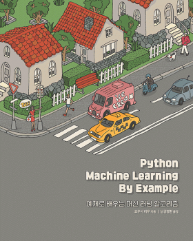

# 예제로 배우는 머신러닝 알고리즘
Python Machine Learning By Example

[원서명](https://www.amazon.com/Python-Machine-Learning-Example-learning/dp/1783553111)
**Python Machine Learning By Example**
Easy-to-follow examples that get you up and running with machine learning

이 책에서 다루는 여러 가지 프로젝트를 충실히 익히고 나면 파이썬 기반의 머신 러닝 에코시스템의 전체 개념이 더욱 명확하게 정립될 것이다.

- 1장, **파이썬과 머신 러닝 시작하기**
- 2장, **텍스트 분석 알고리즘을 이용한 20 뉴스그룹 데이터세트 분석** (차원 축소화 기술, 주성분 분석(PCA), KNN(K-nearest neighbors))
- 3장, **나이브 베이즈를 이용한 스팸 메일 탐지** (나이브 베이즈, 분류 성능 평가, 모델 선택과 튜닝, 교차 검증)
- 4장, **SVM을 이용한 뉴스 토픽 분류** (SVM, 커널 머신, 오버피팅, 정규화)
- 5장, **트리 기반 알고리즘을 이용한 클릭스루 예측** (의사결정 트리와 랜덤 포레스트 알고리즘)
- 6장, **로지스틱 회귀를 이용한 클릭스루 예측** (로지스틱 회귀 분류기, 변수 인코딩, L1, L2, 피처 셀렉션, 온라인 러닝, SGD)
- 7장, **회귀 알고리즘을 이용한 주가 예측** (금융 관련 기본 개념)
- 8장, **모범 사례**

 

